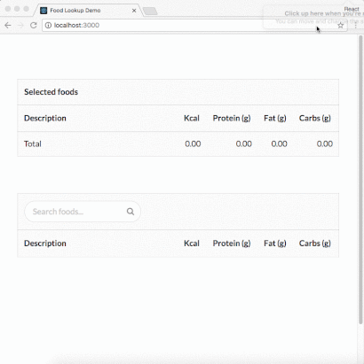

# QA Automation Technical Challenge

The repo contains the interview challenge for the QA Automation Engineer position.

## The Challenge

The goal of this challenge is to...
1. See how you approach problem solving and use your skills to create an elegant engineering solution. 
2. See how you externalize the problem and communicate your work to other team members.


## The Problem

Skycatch needs to be able to automate the testing performed on its UI in order to scale our testing capabilities and testing coverage of our products. In order to do this we need to establish good processes and systems for our github projects. 

One of the major ways of ensuring quality of our code on Github is by establishing good safe workflows for our developers to follow that help ensure the quality of our codebases while still enabling developers to independently execute on their tasks.

Further, we want to move from performing manual UI tests to instead writing and maintaining automated UI tests so that we can quickly and easily execute UI tests on every commit.

This repo contains a simple react/node js web application along with the details of the challenge. It contains everything you need to get started with your technical challenge.


## Requirements

**Minimum Requirements**
* Setup and configure a protected workflow for your repository on github that a developer would follow to contribute code to the project
* Setup and configure CI for your project to kick off any scripts that need to be run as part of your project’s workflow
* Setup an automated UI testing framework that runs as part of your CI workflow
* Write a couple of examples tests that show your system working and demonstrate how developers would write automated UI tests using your chosen technologies
* Architecture document and/or diagrams describing how you’ve structured your automated testing solution and what the workflow looks like for developers to commit to the repository.

**Bonus Points**
* Consider how this system will scale as the number of tests increase
* Consider how to manage and clean up test data in the database


## Deliverables

**Code**

Github repository that…
* Has a safe commit/PR workflow established
* Has CI setup to execute tests on every commit
* Has an automated testing framework in place that runs the automated UI tests
* Has a few working example tests written
* You have added the Skycatch reviewer (brianneisler) as an admin collaborator (so we can see the configuration settings you've used)

You can use boilerplate or third party libraries, just don’t plagiarize someone else's code.

**Documentation**
* Repo configuration documentation (how did you configure your repo?)
* Architecture documentation 
  * How did you setup CI? 
  * How did you setup your testing framework?
* Workflow documentation
  * What is the workflow that a developer follows to commit code to the project?


## Prerequisites
* You will need node js 8+ installed to get started with this challenge.

## Getting Started

To get started with this challenge, first fork the repo. 

## Setup
Setup the repo by cloning it down from github
```
git clone https://github.com/your-user-name/qa-automation-challenge.git
cd qa-automation-challenge
```

Install the repo by running the setup script
```
npm run setup
```

## Running the application locally
You can start the application by simply running the start command
```
npm start
```


## About the web app in this project
This project is built using the setup generated by `create-react-app` alongside a Node Express API server.




## Overview

`create-react-app` configures a Webpack development server to run on `localhost:3000`. This development server will bundle all static assets located under `client/src/`. All requests to `localhost:3000` will serve `client/index.html` which will include Webpack's `bundle.js`.

To prevent any issues with CORS, the user's browser will communicate exclusively with the Webpack development server.

Inside `Client.js`, we use Fetch to make a request to the API:

```js
// Inside Client.js
return fetch(`/api/food?q=${query}`, {
  // ...
})
```

This request is made to `localhost:3000`, the Webpack dev server. Webpack will infer that this request is actually intended for our API server. We specify in `package.json` that we would like Webpack to proxy API requests to `localhost:3001`:

```js
// Inside client/package.json
"proxy": "http://localhost:3001/",
```

This handy features is provided for us by `create-react-app`.

Therefore, the user's browser makes a request to Webpack at `localhost:3000` which then proxies the request to our API server at `localhost:3001`:


This setup provides two advantages:

1. If the user's browser tried to request `localhost:3001` directly, we'd run into issues with CORS.
2. The API URL in development matches that in production. You don't have to do something like this:

```js
// Example API base URL determination in Client.js
const apiBaseUrl = process.env.NODE_ENV === 'development' ? 'localhost:3001' : '/'
```

This setup uses [concurrently](https://github.com/kimmobrunfeldt/concurrently) for process management. Executing `npm start` instructs `concurrently` to boot both the Webpack dev server and the API server.
